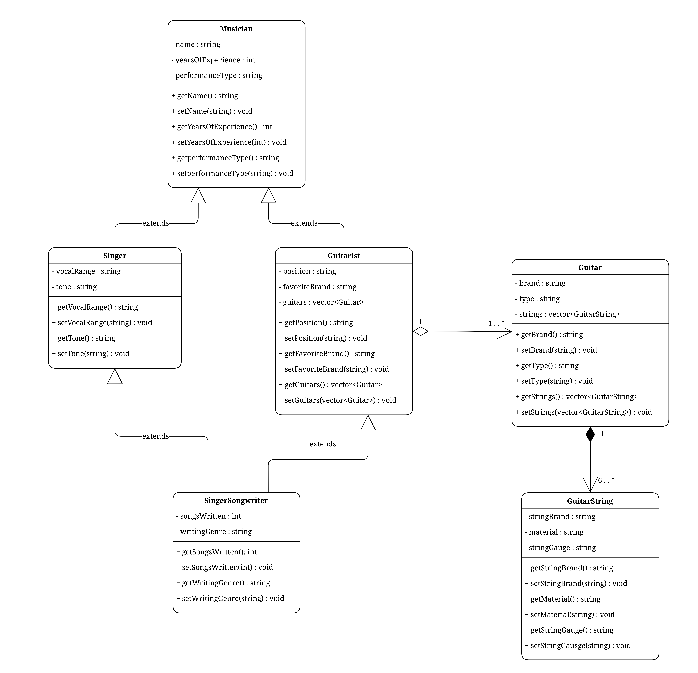
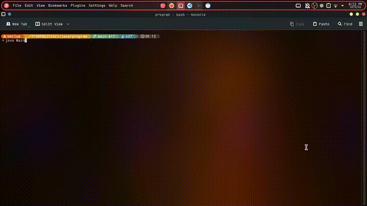
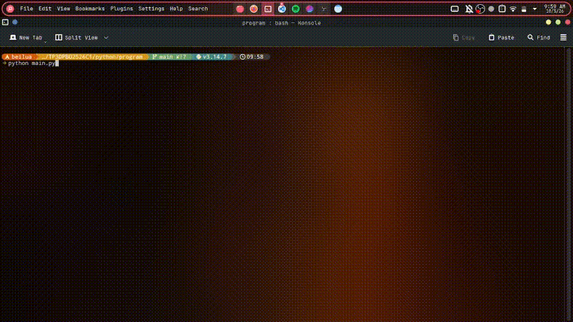

# TP3DPBO2526C1

Program pendataan musisi (Singer, Guitarist, SingerSongwriter) dan gitar beserta senarnya dalam 3 bahasa: C++, Java, Python.

## Janji

Saya Nabila Attaya Putri Cahyadi dengan NIM 2508355 mengerjakan Tugas Praktikum 3 pada Mata Kuliah Desain dan Pemrograman Berorientasi Objek (DPBO) untuk keberkahan-Nya maka saya tidak melakukan kecurangan seperti yang telah dispesifikasikan. Aamiin

## Desain Diagram Program

## Atribut dan Method Setiap Kelas

- `Musician`: `name`, `yearsOfExperience`, `performanceType` + getter/setter.
- `Singer : Musician`: `vocalRange`, `tone` + getter/setter.
- `Guitarist : Musician`: `position`, `favoriteBrand`, `guitars[]` + getter/setter + `addGuitar()`.
- `SingerSongwriter : Singer + Guitarist`: `songsWritten`, `writingGenre` + getter/setter.
- `Guitar`: `brand`, `type`, `strings[]` + getter/setter + `makeStringData()`.
- `GuitarString`: `stringBrand`, `material`, `stringGauge` + getter/setter.

## Desain Program (Inheritance & Composition)

- Inheritance: `Singer -> Musician`, `Guitarist -> Musician`, `SingerSongwriter -> Singer + Guitarist` (diamond).
- C++/Python: multiple inheritance langsung. Java: `extends Singer implements GuitaristTrait` (single inheritance + interface).
- Aggregation: `Guitarist o-- Guitar` (gitar ditambah via `addGuitar`, bisa hidup tanpa gitaris).
- Composition: `Guitar ◆-- GuitarString` (string dibuat di dalam `Guitar`, wajib 6, gauge unik).

## Alur Program (berlaku untuk 3 bahasa)

1. Buat list `singers`, `guitarists`, `singerSongwriters`, `guitars` statis.
2. `addGuitar()` ke tiap Guitarist/SingerSongwriter, gabung ke list `musicians`.
3. `printGuitars()` lalu `printMusicians()` per kelompok kelas.
4. Tambah data baru statis (`Taka Moriuchi` + 2 gitar), print ulang, exit.

## Dokumentasi

### C++

### Java

### Python

